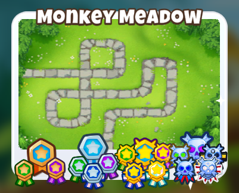
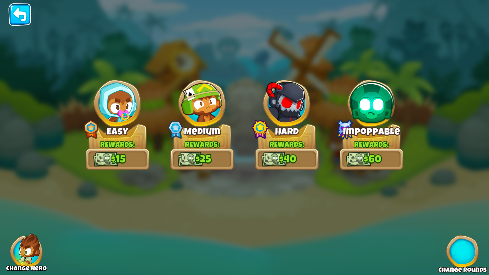
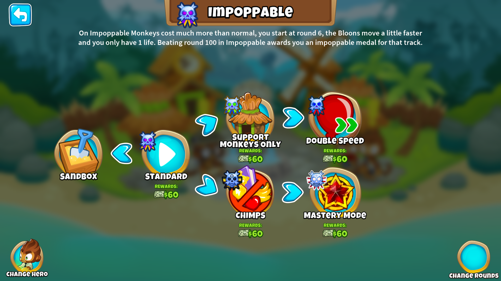

<h1 align="center">

ImpoppablePlus
</h1>

Extends Impoppable mode by making it an entirely new difficulty.

The new Impoppable difficulty adds 4 game modes: 
- Support Only
- Double Speed
- Mastery Mode
- Impoppable Sandbox

## Support Only
You can only use support category towers and a hero.

## Double Speed
All bloons (including MOABs) move twice as fast!

## Mastery Mode
Upgrades bloon ranks as follows:

|Standard|Mastery|
|-|-|
|Red|Blue|
|Blue|Green|
|Green|Yellow|
|Yellow|Pink|
|Pink|Black|
|Black|Zebra|
|White|Purple|
|Purple|Fortified Lead|
|Lead|Rainbow|
|Zebra|Rainbow|
|Rainbow|Ceramic|
|Ceramic|MOAB|
|MOAB|BFB|
|BFB|DDT|
|DDT|ZOMG|
|ZOMG|BAD|
|BAD|Fortified BAD|
|Fortified BAD|Fortified BAD|

Reduces cash per pop 20 rounds early:

|Rounds|Cash per Pop|
|-|-|
|1-30|100%|
|31-40|50%|
|41-65|20%|
|66-80|10%|
|81-100|5%|
|101+|2%|

And replaces round 100 with 5 fortified BADs. 

## Impoppable Sandbox
Sandbox mode with impoppable difficulty tower and upgrade pricing.

## White Border

## Impoppable Difficulty

## Impoppable Gamemodes

